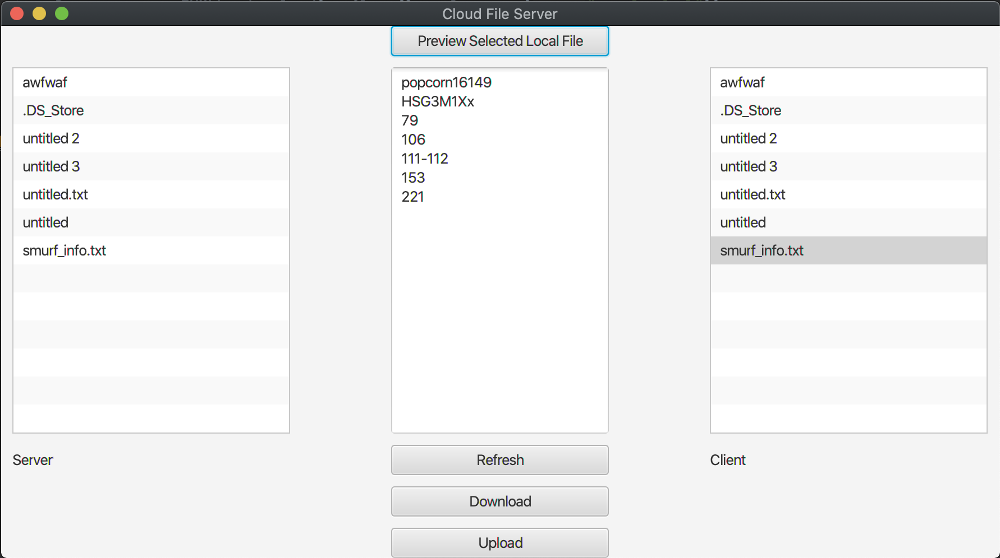

Project Information: This project incorporates a multi-threaded server with a client connection including a individual UI.  This UI contains several key parts of the both the server side and the connected local library.  The contents of the server's files and the local files passed through the command line are shown in the Client's UI.  The UI also contains a file preview to allow for the user to see the contents of any local file that they select before uploading it to the server.  The upload and download buttons work accordingly allowing you to transfer files from the server to the local directory and vice versa.  The Refresh button was implemented to allow for the user to have a consistent and updated list of both directories current files.

Improvements: Improvements were made to increase the visual appeal of the UI allowing for a nicer colour for your eyes.  The Refresh button was added to allow for a consistent display of the servers file contents as well as the local directory's files.  The local file preview button and textArea was added to allow you to preview your local files before uploading them to the server.

How to run:  To run our application Clone the repository found at https://github.com/David-B-Robertson/Ethan-and-David-Systems-Assignment-1.  Open the Server project in Intelliji and run the program.  Open the Client Project in Intellij.  Set your local repository to be your location of the local file that will be connected to the server.  Run the CLient program.  The UI will appear and the refresh button will be required to be clicked to get started.  From there you can freely upload and download and preview all your files.

References: https://stackoverflow.com/questions/18441675/javafx-symbol-not-found-referring-from-class/18441936#18441936  Tutorial for File Reader in FXML
https://staticfinal.blog/2015/09/21/binding-a-list-of-strings-to-a-javafx-listview/ ListView adaptation in FXML
https://docs.oracle.com/javase/8/javafx/api/javafx/scene/control/ListView.html Oracle Doc for ListView
https://www.javatpoint.com/command-line-argument Getting Command line args for Javafx
